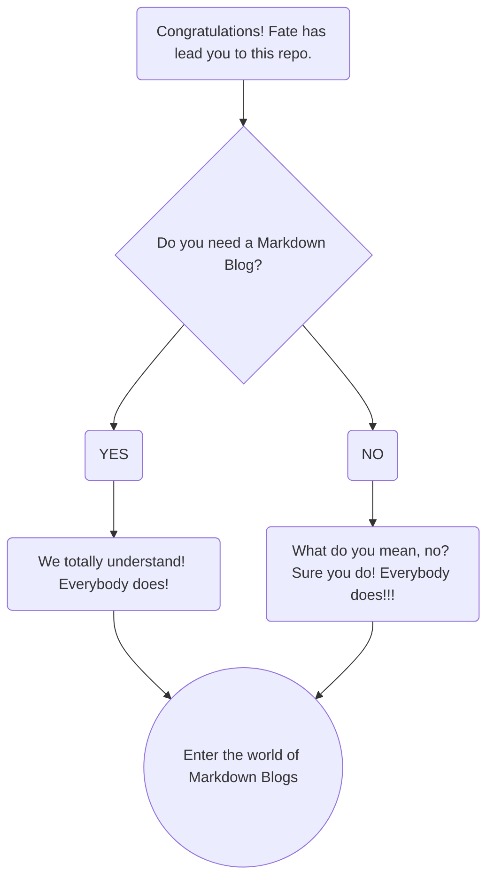
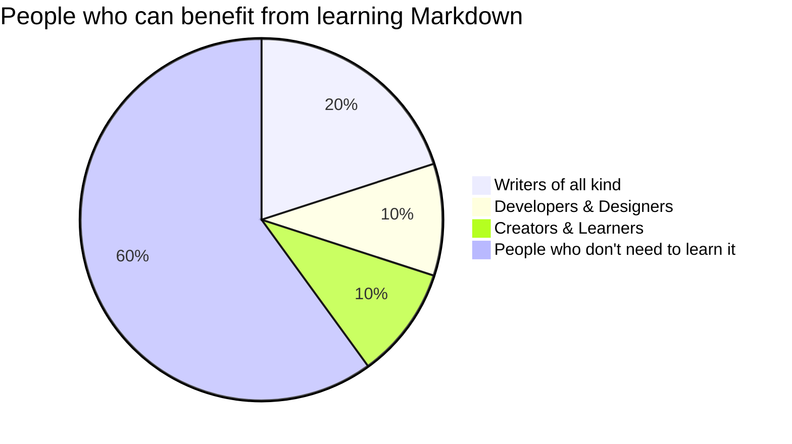
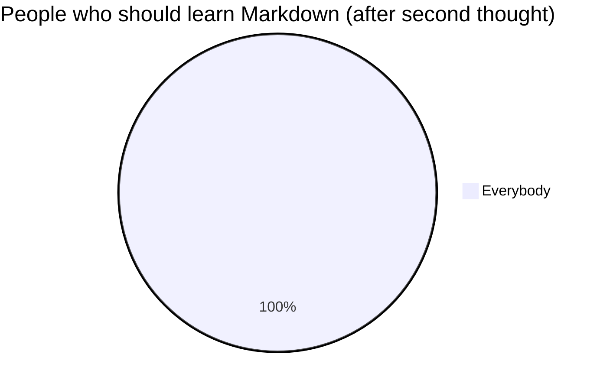

```mermaid
flowchart TB
A(Congratulations! Fate has lead you to this repo.)-->B{Do you need a Markdown Blog?}
B-->C(YES)
C-->Ca(We totally understand! Everybody does!)
B-->D(NO)
Ca-->END((Enter the world of Markdown Blogs))
D-->Da(What do you mean, no? Sure you do! Everybody does!!!)
Da-->END
```

```mermaid
pie title People who can benefit from learning Markdown

"Writers of all kind": 20

"Developers & Designers" : 10

"Creators & Learners" : 10

"People who don't need to learn it": 60
```

```mermaid
pie title People who should learn Markdown (after second thought)

"Everybody" : 100
```
